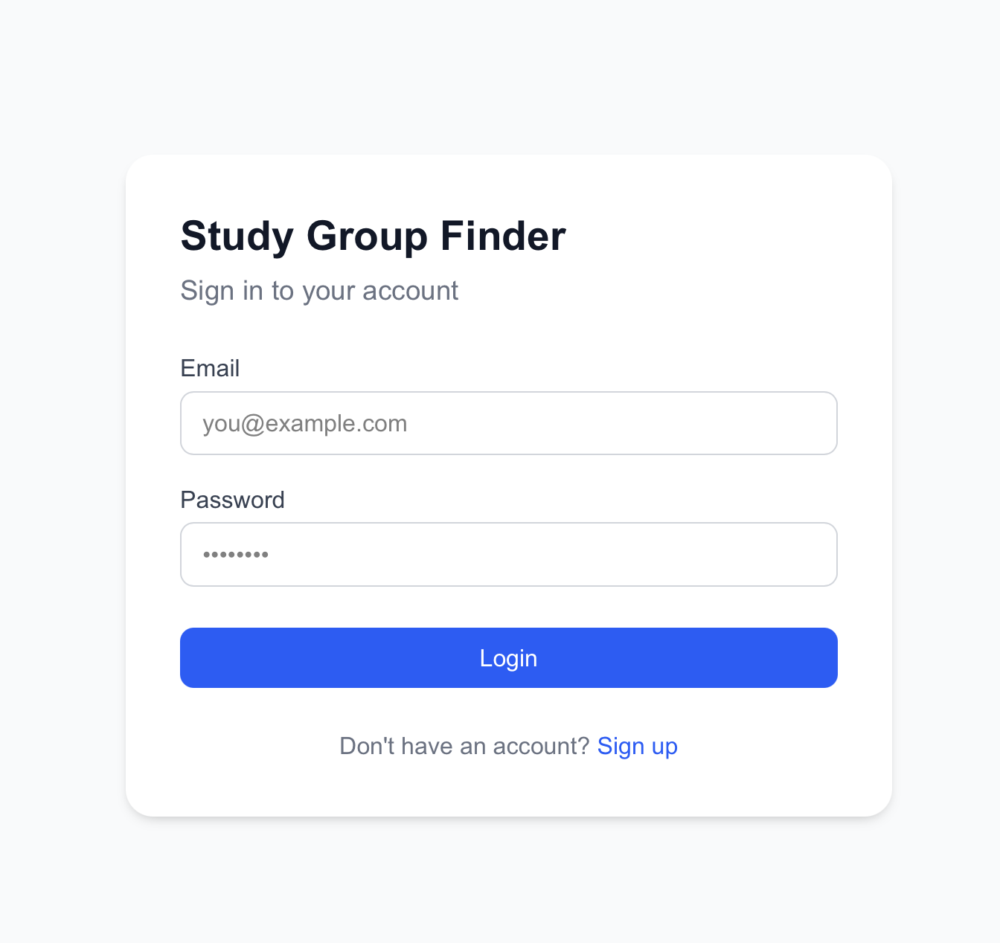
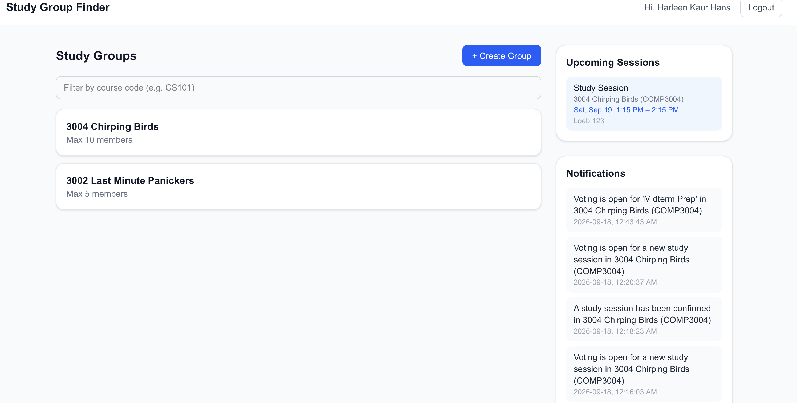
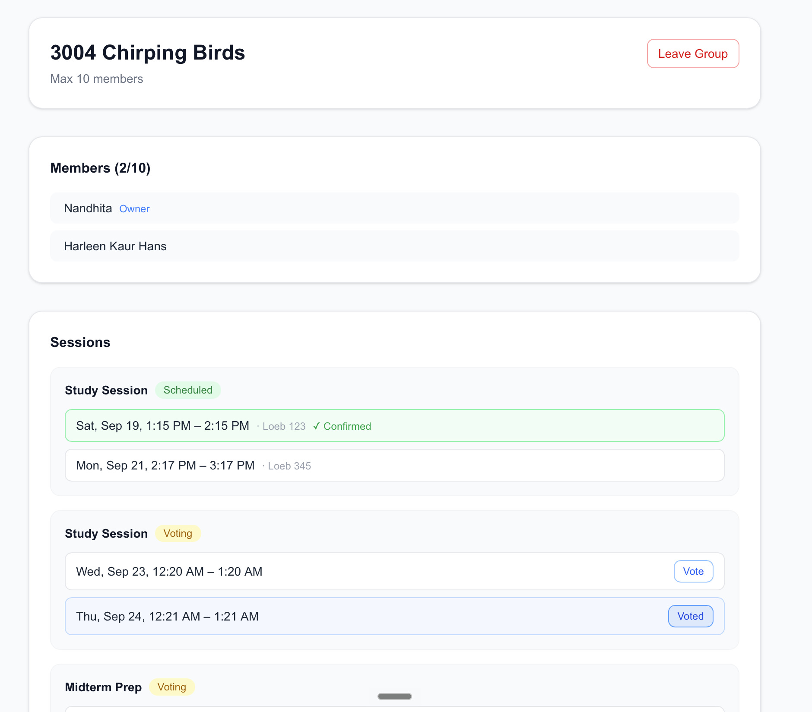
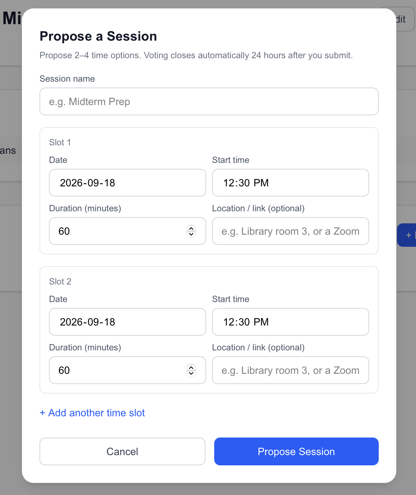

# Study Group Finder

A full-stack web app that helps students find study partners for the courses they're struggling with, form groups, and actually agree on a time to meet — without the usual 40-message group chat.

Post a course you need help with → match with classmates in the same boat → the group owner proposes a few time slots → everyone votes → the owner confirms one → everybody gets reminded before it happens.

---

## Core Features

- **Course-based matchmaking** — students post the courses they need help with and find others looking for the same thing.
- **Study groups** — create, join, and manage groups tied to a specific course.
- **Propose → Vote → Confirm scheduling** — the group owner proposes 2–4 time slots, members vote on every slot they're free for, and the owner manually confirms one (no auto-scheduling — a human always makes the final call).
- **Live vote tracking** — the owner sees vote counts and who voted for what, refreshed on page load.
- **In-app notifications** — a running feed of what's happened in your groups (votes opening, sessions confirmed or cancelled, etc.).
- **Automatic reminders** — scheduled reminders fire 24 hours and 1 hour before every confirmed session, sent only to the members who said they'd be there.
- **JWT authentication** — secure, HttpOnly-cookie-based auth, so tokens are never exposed to client-side JavaScript.

## How Scheduling Works

1. The group owner proposes 2–4 candidate time slots (date, time, duration, location or video link).
2. A 24-hour voting window opens — members mark every slot they're free for and can change their vote anytime before the deadline.
3. The owner reviews the results (visible only to them) and manually confirms a slot — regardless of vote counts, ties, or how many people voted. Owners aren't bound by the vote; it's just information.
4. Everyone gets notified the session is confirmed, and reminders are automatically scheduled for 24h and 1h beforehand.

## Tech Stack

| Layer | Technology |
|---|---|
| Frontend | React (Next.js), TypeScript, Tailwind CSS |
| Backend | FastAPI (Python), SQLAlchemy, Alembic |
| Database | PostgreSQL |
| Auth | JWT via HttpOnly cookies |
| Scheduling | APScheduler (persisted job store) |
| Frontend hosting | Vercel |
| Backend & DB hosting | AWS (Amazon ECS + RDS), Dockerized |

## Architecture

```
React (Next.js) ──HTTP/JSON──▶ FastAPI ──SQL──▶ PostgreSQL
   [Vercel]                  [AWS ECS, Docker]    [AWS RDS]
```

Protected routes send a JWT in an HttpOnly cookie; the backend validates it on every request and returns a 401 if it's missing or expired, which the frontend uses to redirect to `/login`.

## Screenshots









## Getting Started

### Backend
```bash
cd backend
python -m venv venv
source venv/bin/activate
pip install -r requirements.txt

cp .env.example .env   # fill in DATABASE_URL, JWT_SECRET, etc.
alembic upgrade head
uvicorn app.main:app --reload
```

### Frontend
```bash
cd frontend
npm install
npm run dev
```

The frontend expects the backend at `http://localhost:8000` by default (set via `NEXT_PUBLIC_API_URL` for other environments).

## Project Structure

```
Study-Group-Finder/
├── backend/            # FastAPI app
│   ├── app/
│   │   ├── models/     # SQLAlchemy models
│   │   ├── routes/     # API endpoints
│   │   ├── schemas/    # Pydantic request/response schemas
│   │   ├── services/   # Business logic (notifications, scheduling)
│   │   └── core/       # Config, security, scheduler setup
│   └── alembic/        # Database migrations
└── frontend/           # Next.js app
    └── app/
        ├── dashboard/  # Main dashboard + upcoming sessions
        ├── groups/     # Group pages, session voting UI
        ├── login/ register/
        └── lib/        # API client
```

## Auth Notes

Sessions last 7 days (no refresh token at this stage — once the JWT expires, the user simply logs back in). Cookies are configured to work securely across the Vercel/AWS domain split in production (`Secure`, `SameSite=None`) while staying dev-friendly locally.
